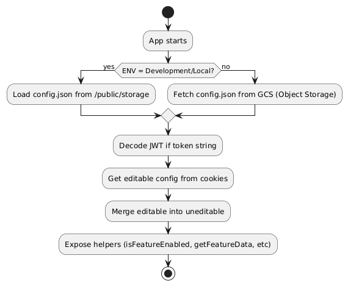

# Dynamic Frontend Remote Config

This project is a **Next.js 15** application designed to demonstrate **dynamic frontend remote configuration**.  
Instead of hardcoding configuration values, the app fetches a JSON config file from an object storage (e.g. Google Cloud Storage, AWS S3, etc.) at runtime.  

## Features
- Built with **Next.js 15 + React 19**  
- Remote configuration served via **object storage** or **CDN**  
- Development mode generates local `remote-config.json` for testing  
- Supports **JWT-based authentication helpers** (`jwt-decode`, `jwt-encode`)  
- Docker-ready for production deployments  

## Live Demo

You can try out the live demo of the remote configuration feature:

- [Live demo of the configuration](https://dynamic-frontend-remote-config.netlify.app/)
- [Demo with disabled feature](https://dynamic-frontend-remote-config.netlify.app/subject-access-request)

These links demonstrate the dynamic configuration in action, including the features controlled by remote configuration settings.

## Configuration and JWT Decoding

The configuration fetched by the app (either editable by cookies or not) can be observed directly in the browser's **Network** tab under the request for `config`. You can also inspect the cookies used for storing remote configuration values.

### Steps to Decode JWT:
1. Open your browser's Developer Tools (e.g., right-click → "Inspect" → go to the **Application** or **Network** tab).
2. Look for the `config` request or inspect cookies.
3. Copy the JWT string (it will look like a long string of characters).
4. Visit [JWT.io](https://jwt.io/) and paste the copied token into the "Encoded" field.
5. JWT.io will automatically decode the JWT token and display its payload for inspection.


## Diagrams

The following diagrams illustrate how the Dynamic Frontend Remote Config works across different environments and flows:

### Activity Diagram


### Sequence Diagram


### Use Case Diagram


### High-Level Architecture


## Development

Generate a local remote config file and start the dev server:

```bash
npm run dev
```

This will run `scripts/generate-remote-config.mjs` and place the result inside `/public`.  
Then you can open [http://localhost:3000](http://localhost:3000).  

## Production Build

Production build does **not** generate a remote config automatically.  
The file must be uploaded manually to object storage, and the app will read from the URL provided in the environment variables.

```bash
npm run build
npm start
```

Or with Docker:

```bash
docker build -t dynamic-frontend-remote-config .
docker run -p 3000:3000   -e NEXT_PUBLIC_REMOTE_CONFIG_URL="https://storage.googleapis.com/assets/shinra/remote-config.json"   -e NEXT_PUBLIC_REMOTE_CONFIG_KEY="99pL2U76wgj82nhwrDdWNEGQyTDcRy5j"   dynamic-frontend-remote-config
```

## Environment Variables

| Variable | Description | Example |
|----------|-------------|---------|
| `NEXT_PUBLIC_REMOTE_CONFIG_URL` | URL to the remote config JSON | `https://storage.googleapis.com/assets/shinra/remote-config.json` |
| `NEXT_PUBLIC_REMOTE_CONFIG_KEY` | API key or shared secret for validation | `99pL2U76wgj82nhwrDdWNEGQyTDcRy5j` |

## Project Structure

```
.
├── app/                  # Next.js App Router
├── public/               # Static assets (local dev config generated here)
├── scripts/              # Utility scripts (e.g. generate-remote-config.mjs)
├── Dockerfile
├── package.json
└── README.md
```

## License

This project is licensed under the [MIT License](./LICENSE).
